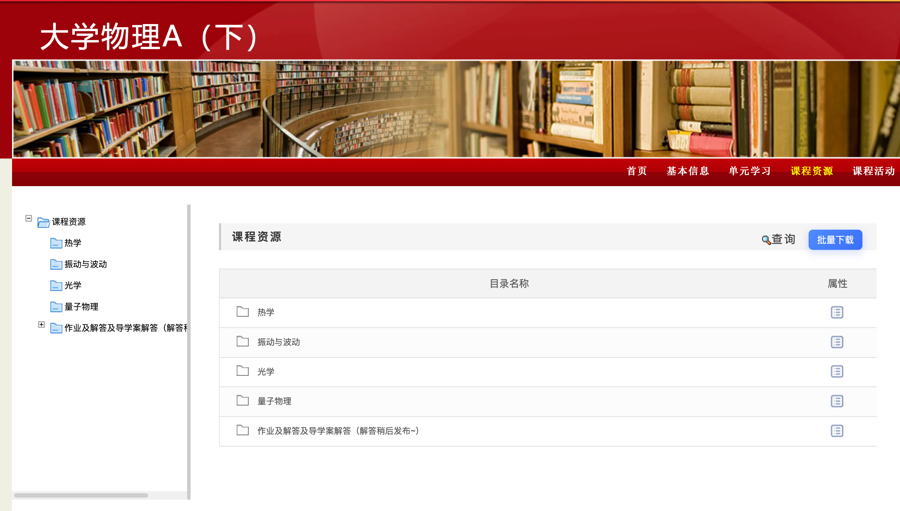

# College Resource Downloader
# THEOL 课程资源批量下载器


用于在 THEOL 课程资源页面中批量勾选并下载文件，减少逐个点击下载的重复操作。

项目截图：




## 功能特性

- 自动递归扫描当前课程资源目录
- 树状结构展示，支持按目录批量勾选
- 支持 `ZIP` 打包下载
- 支持按原目录结构下载到本地文件夹（浏览器支持时）
- 自动补全常见文件后缀（基于图标与响应头推断）
- 下载前自动估算总大小（可估算项）

## 支持的学校站点

默认匹配规则：

- `*://*/meol/*`

已确认站点：

- 中国农业大学在线教育综合平台（CAU THEOL）：`https://jx.cau.edu.cn/meol/`

理论上支持使用 CAU THEOL 或相近版本搭建的平台。欢迎提交 issue/PR 补充兼容站点。

## 快速使用

### 方式 1：油猴脚本（推荐给普通用户）

适用于 Tampermonkey、ScriptCat 等脚本管理器。

1. 在项目 Releases 下载 `theol-batch-downloader-<version>.user.js`
2. 用脚本管理器安装脚本
3. 打开学校 THEOL 的“课程资源”页面
4. 点击页面上的 `批量下载` 按钮

### 方式 2：Chromium 浏览器扩展

适用于 Chrome、Edge、360、夸克等 Chromium 内核浏览器。

1. 在 Releases 下载 `theol-batch-downloader-chrome-<version>.zip`
2. 解压后进入浏览器扩展管理页面
3. 打开“开发者模式”
4. 选择“加载已解压的扩展程序”，指向解压目录

### 方式 3：Firefox 浏览器扩展

适用于 Firefox / Zen 等。

1. 在 Releases 下载 `theol-batch-downloader-firefox-<version>.zip`
2. 通过临时加载或打包签名方式安装（取决于你的浏览器策略）

## 使用流程

1. 进入课程的“课程资源”列表页
2. 点击页面右上区域出现的 `批量下载` 按钮
3. 等待脚本扫描资源树
4. 勾选需要下载的目录/文件
5. 选择下载方式：
   - `下载压缩包 ZIP`
   - `下载到本地文件夹`

说明：

- 若浏览器不支持 `showDirectoryPicker`，`下载到本地文件夹` 会自动回退为逐个下载任务。

## 项目原理与边界

本项目通过页面可见 DOM 结构解析课程资源列表，并以当前登录会话发起同源请求下载文件。

- 不包含逆向破解、绕过鉴权、提权或脱库逻辑
- 不绕过学校平台的访问控制
- 仅在你已具备访问权限的资源范围内工作

请遵守学校与课程相关规定，仅用于合法、合规、授权范围内的学习活动。

## 常见问题

### 1）按钮没有出现

- 请确认当前页面是 THEOL 的“课程资源”列表页
- 某些学校主题改版后，按钮注入位置可能变化，可提 issue 附页面截图

### 2）扫描不到文件

- 可能当前页面并非资源列表 iframe 的实际内容页
- 尝试先手动进入具体资源目录后再点击 `批量下载`

### 3）部分文件后缀异常

- 可在 `src/config/file-mappings.js` 增补图标名与后缀映射

### 4）站点无法匹配

- 可在 `src/config/sites.json` 添加你的站点匹配规则

## 本地开发与构建

环境要求：

- Node.js 18+
- npm

安装依赖并构建：

```bash
npm install
npm run build
```

构建产物：

- `dist/userscript/theol-batch-downloader.user.js`
- `dist/chrome/manifest.json`
- `dist/chrome/content-script.js`
- `dist/firefox/manifest.json`
- `dist/firefox/content-script.js`

## 关键配置

- `src/config/sites.json`：站点匹配规则（userscript 与 extension 共用）
- `src/config/file-mappings.js`：图标名 / MIME 与后缀映射

## 项目结构

- `src/core/app.js`：应用入口与流程编排
- `src/core/context/resource-context.js`：页面上下文探测（主页面/iframe）
- `src/core/tree/tree-model.js`：资源树扫描与勾选联动
- `src/core/ui/template.js`：面板模板
- `src/core/ui/panel.js`：面板渲染与交互
- `src/core/ui/style.js`：样式注入
- `src/core/download/actions.js`：下载逻辑（ZIP / 文件夹）
- `src/core/shared/helpers.js`：工具函数
- `src/core/shared/constants.js`：全局常量
- `src/entries/userscript.js`：油猴入口
- `src/entries/content-script.js`：扩展入口
- `build/build.mjs`：打包脚本（userscript + chrome/firefox 清单）

## 维护与贡献

欢迎 issue / PR（建议简体中文）。

提交站点兼容相关改动前，请先在目标站点完整自测后再提交。由于学校平台访问通常受校园网络和账号限制，维护者可能无法直接复现你的环境。

## 第三方依赖与许可证

- 第三方许可证声明：`THIRD_PARTY_NOTICES.md`
